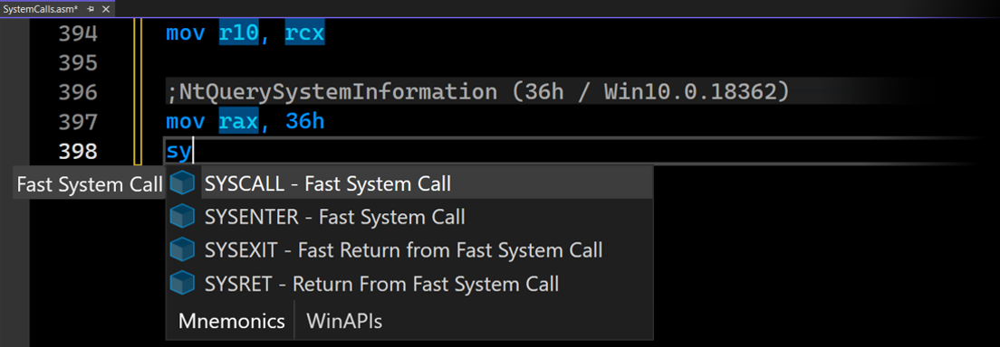
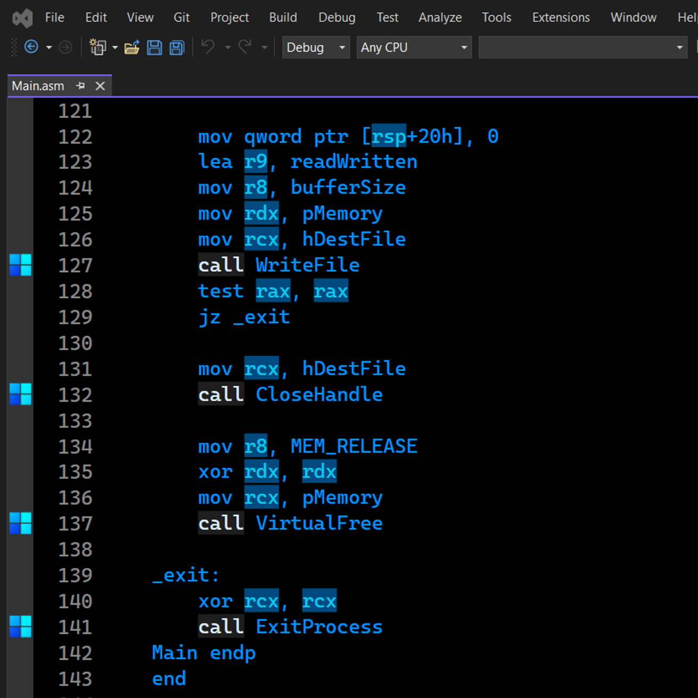
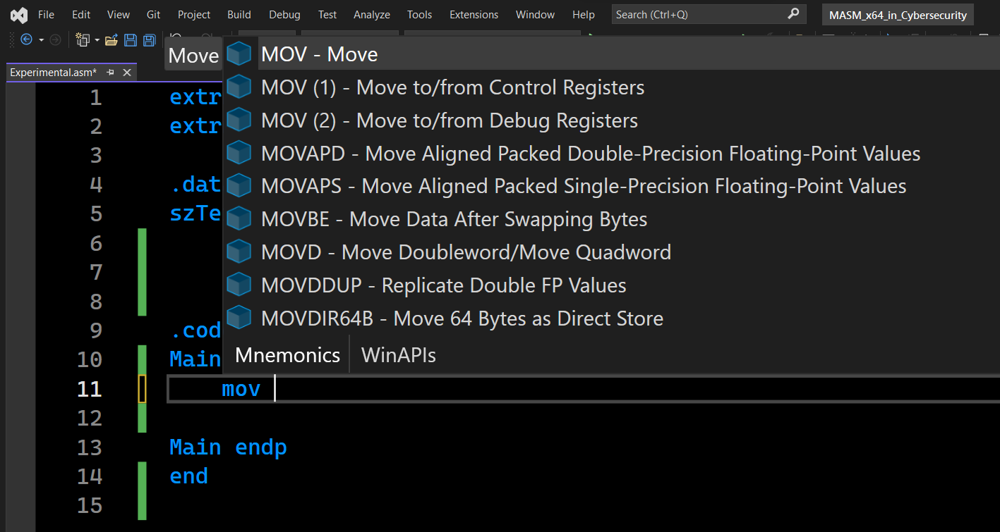
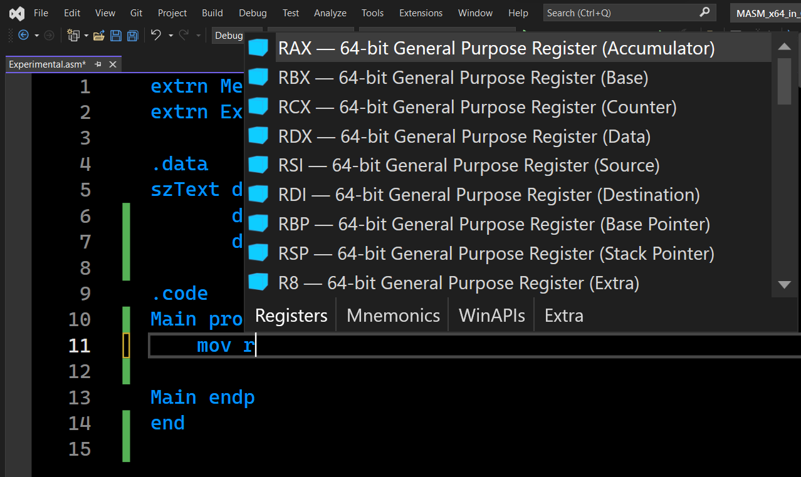
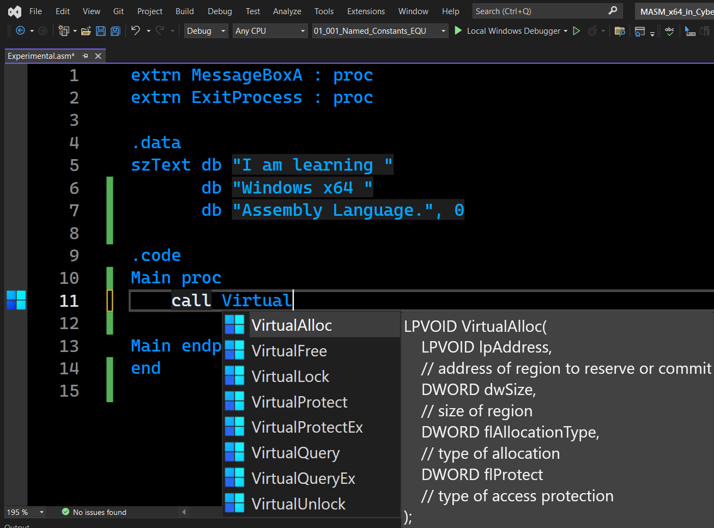
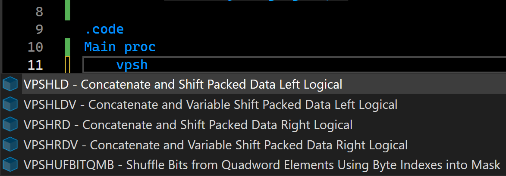

# ChASM is low budget Syntax Colorizer

The idea of ChASM extension is to provide basic syntax coloring for x86/x64 Assembly Language (MASM) in Microsoft Visual Studio.

# ChASM Features

- Highlight General Purpose Registers (x86/x64)
- Descriptions for Over 1000 Mnemonics
- 150+ General Purpose Registers with Description
- Detect Common WinAPI Functions Calls
- Syntax Help for Over 1500 Mostly Used WinAPI Functions
- Colorize One Line Comments
- Highlight System Calls (SYSCALL)
- Signature Help for Mnemonics

# Download ChASM
https://ethical.blue/download/ChASM.vsix
